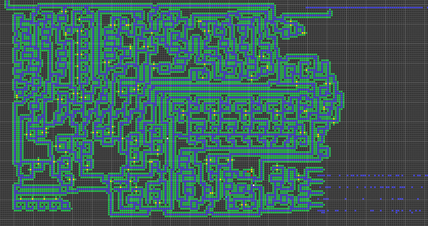
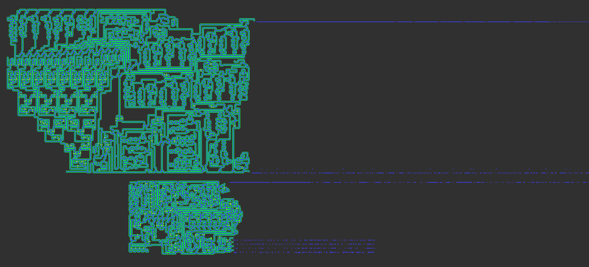

# mahler-replicator
"Mahler-Replicator" is a classical Universal Turing Machine made of cellular automata. Its main purpose is to create copies of itself. It is intended to be used with the Golly cellular automata program.

To run it, copy "Devore2.rule" into Golly's rules folder, open "Mahler-rep.rle" in Golly, and set the pattern running.

Mahler-rep is 160x faster than Devore-rep, the Devore ruleset replicator packaged with golly.

For a breakdown of the optimizations Mahler-rep has over Devore-rep, check out the comments for Mahler-rep.rle